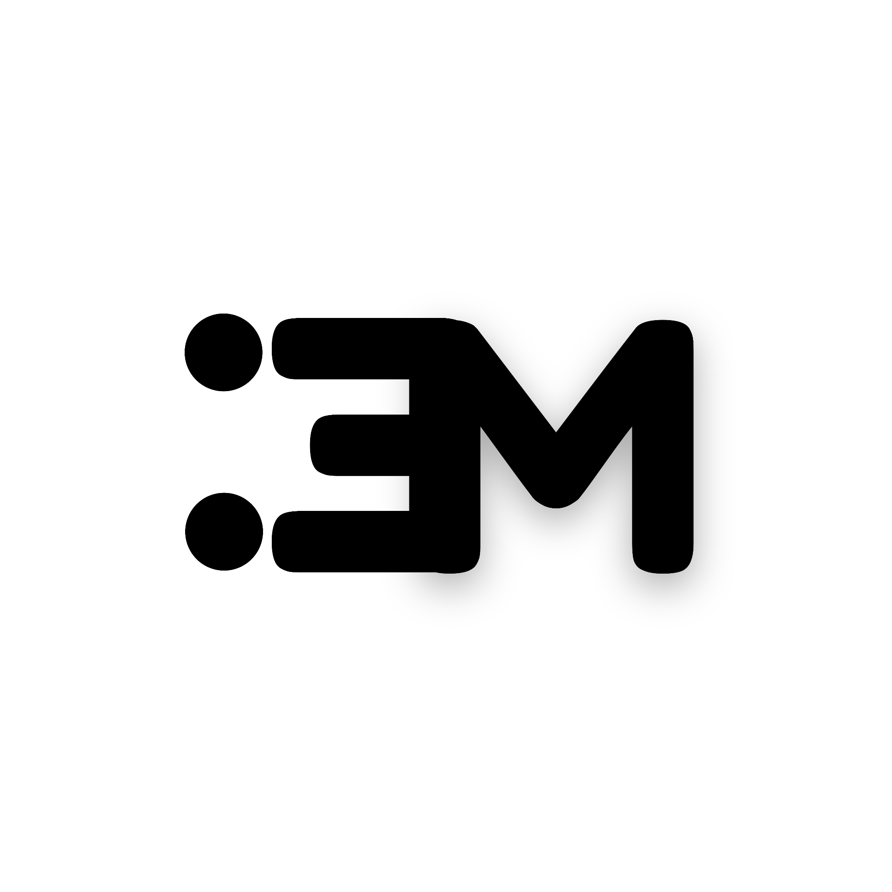

  
    

  

# **Mervlot**  
⚡ Building systems, tools, and real-world applications ⚡  

---

## 👤 About Me  
I’m **Ogunmuyiwa Muhammad**, a developer focused on building **real systems and tools**.

I work across:
- 🌐 Web Development  
- ⚙️ System-Level Programming  
- 🔐 Ethical Hacking  

I don’t just code—I build things that solve problems.

---

## 🛠 Tech Stack  

**Languages:**  
- JavaScript (ES6+) ⚡  
- TypeScript 🔷  
- Go 🐹  
- Kotlin ☕  
- Python 🐍  
- Bash 🖥️  
- C ⚙️  

**Frameworks & Tools:**  
- React ⚛️  
- Next.js 🚀  
- Express.js 🌐  
- Gin (Go) ⚡  
- TailwindCSS 💨  

**Databases:**  
- MongoDB 🍃  
- PostgreSQL 🐘  

**Systems & Tools:**  
- Linux (Debian, Arch, XFCE) 🐧  
- Git & GitHub 🐙  
- Docker (basics) 🐳  

---

## 🚀 What I Build  

- Full-stack web applications  
- Developer tools & automation systems  
- Backend APIs and services  
- System-level projects  

---

## 🎯 Focus  

- Building the **Mervlot ecosystem**  
- Creating tools developers actually use  
- Growing into system-level and infrastructure engineering  

---

## 📌 Featured Projects  

- **MervTask** → Task management system (Go + React + React Native)  
- **KPM** → Kotlin Package Manager (alternative to Maven/Gradle)  
- **MervOS** → Low-level system project in C  
- **Mervlot Mail Engine** → Email automation tool  

---

## 🔗 Connect  

  
    
    
    

  

---

## ⚖️ Note  

This GitHub is an active workspace.  
Some projects are experimental or in progress.
