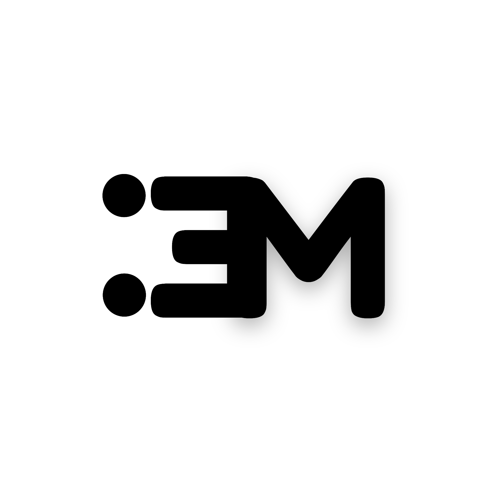

  

# **Mervlot**
⚡ Where Marvel meets Innovation ⚡  

---

## 👤 **About Me**  
I’m **Ogunmuyiwa Muhammad**, a teenage developer passionate about **coding and innovation**.  
Started coding at **13**, now building projects across **frontend, backend, and AI**.  

🌍 My focus:  
- Artificial Intelligence 🤖  
- Full-Stack Web Development 🌐 
- System Development ⚙️  

Always learning, always building. 🚀  

---

## 🛠 **Skills**  

**Languages:**  
- Python 🐍  
- JavaScript (ES6+) ⚡  
- TypeScript 🔷
- Assembly (low-level exploration) i just know abit of x86(32bit) and risc-V
- C (low-level exploration) ⚙️  
- HTML5 / CSS3 🎨 

**Frameworks & Libraries:**  
- React ⚛️  
- Next.js 🚀  
- Express.js 🌐 
- TailwindCSS 💨  

**Databases:**  
- MySQL / MariaDB / SQLite 🗄️  
- MongoDB 🍃 

**Machine Learning / Data Science:**  
- Scikit-learn 🤖  
- Numpy, Pandas 📊  

**Tools & Systems:**  
- Git & GitHub 🐙 
- Linux (Debian, Arch, Kali, XFCE) 🐧 
- Docker (basics) 🐳 
- Vercel ⚡  

---

## 🚀 **Projects**  

- **[Oxaley](https://mervlot.github.io/Oxaley/)** → A modern designer blog website.  
- **[MervDash](https://mervdash.vercel.app/)** → Custom React dashboard for data visualization & admin tooling.  
- **[MervFolio](https://mervlot.vercel.app/)** → My personal portfolio site, built with React + Tailwind.  
- **[MervFlix](https://mervflix.vercel.app/)** → Netflix-inspired movie app with API integration.  

---

## 🎯 **Goals**  

- **Short-term** → Deepen mastery in **Python, Node.js, ML/AI, and full-stack development**.  
- **Long-term** → Build **Mervlot Tech**, a company shaping the future of technology.  

---

## 📚 **Education**  
- **Self-taught developer**: Learning daily via courses, tutorials, and hands-on projects.  

---

## 🔗 **Connect with Me**  

  
  
  
  
  

  

---

## ⚖️ **Copyright Notice**  

***© 2025 Mervlot. All Rights Reserved.***  

This copyright covers all content under **Mervlot**, including:  
- Text, blog posts, documentation  
- Images, graphics, logos  
- Audio/video materials  
- Software & source code  
- Data compilations  

No part of this may be reproduced, modified, or used commercially without explicit written permission. 🚫  

📧 Contact for permissions: **Princeadeite09@gmail.com**  

---
